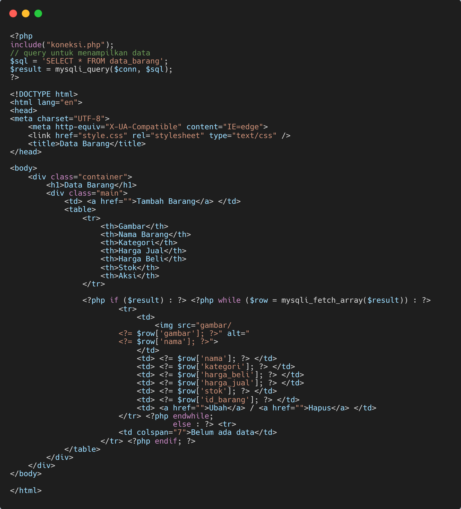

# PHP dan Database MySQL

## Langkah-langkah Praktikum

**Persiapan** Untuk memulai membuat aplikasi CRUD sederhana, yang perlu disiapkan adalah
database server menggunakan MySQL. Pastikan MySQL Server sudah dapat dijalankan
melalui XAMPP.

### Menjalankan MySQL

Untuk menjalankan MySQL Server dari menu XAMPP Control.

### Mengakses MySQL Cilent menggunakan PHHP MyAdmin

Pastikan webserver Apache dan MaySQL server sudah dijalankan. Kemudian melalui browser : http://localhost/phpmyadmin/

### Membuat Database: Studi Kasus Data Barang

### <u>Membuat Database</u>

### <u>Membuat Tabel</u>

### <u>Menambahkan Data</u>

### Membuat Program CRUD

Buat folder **<u>lab8_php_database</u>** pada root directory web server (c:\xampp\htdocs)

Kemudian untuk mengakses direktory tersebut pada web server dengan mengakses URL:
http://locallhost/lab8_php_database/

### Membuat File Koneksi Database

Buat file baru dengan nama **koneksi.php**

Buka melalui browser untuk menguji koneksi database (untuk menyampaikan pesan koneksi berhasil, _**uncomment**_ pada perintah `echo "koneksi berhasil";`)

### Membuat File Index Untuk Menampilkan Data (_Read_)

Buat file dengan nama **index.php**

### Menambahkan Data (_Create_)

Buat file baru dengan nama **tambah.php**

Sebelum di tambah 

Setelah di tambah

### Menghapus Data (_Delete_)

Buat file baru dengan nama **hapus.php**

Sebelum

Sesudah

