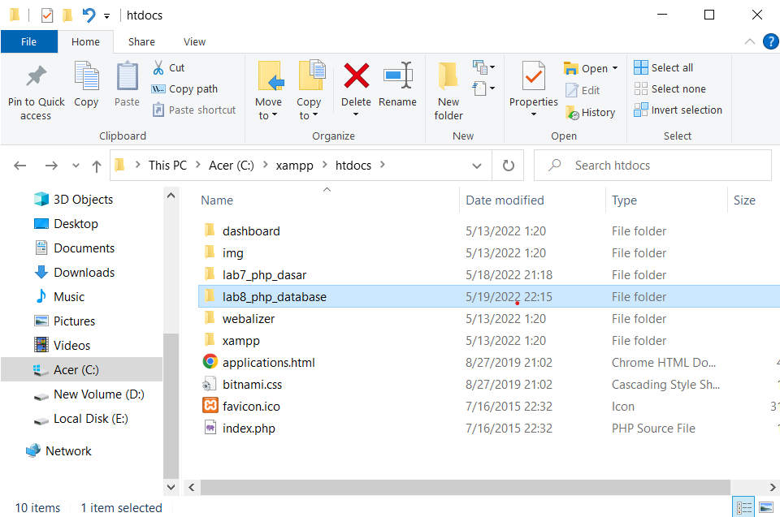
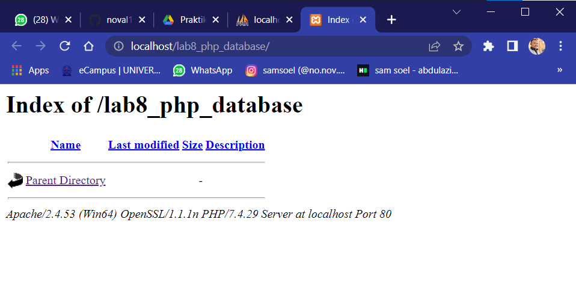
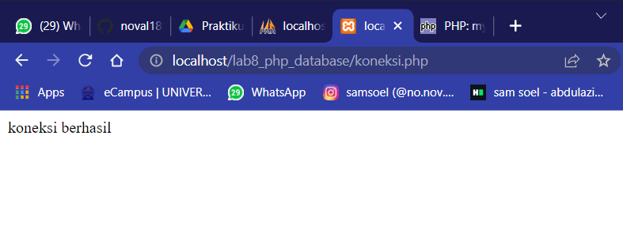

# PHP dan Database MySQL

## Langkah-langkah Praktikum

**Persiapan** Untuk memulai membuat aplikasi CRUD sederhana, yang perlu disiapkan adalah
database server menggunakan MySQL. Pastikan MySQL Server sudah dapat dijalankan
melalui XAMPP.

### Menjalankan MySQL

Untuk menjalankan MySQL Server dari menu XAMPP Control.


### Mengakses MySQL Cilent menggunakan PHHP MyAdmin

Pastikan webserver Apache dan MaySQL server sudah dijalankan. Kemudian melalui browser : http://localhost/phpmyadmin/

### Membuat Database: Studi Kasus Data Barang


### <u>Membuat Database</u>

```PHP
        CREATE DATABASE latihan1;
```

### <u>Membuat Tabel</u>

```php
CREATE TABLE data_barang (
    id_barang int(10) auto_increment Primary Key,
    kategori varchar(30),
    nama varchar(30),
    gambar varchar(100),
    harga_beli decimal(10,0),
    harga_jual decimal(10,0),
    stok int(4)
);
```


### <u>Menambahkan Data</u>

```php
INSERT INTO data_barang (kategori, nama, gambar, harga_beli, harga_jual, stok)
VALUES ('Elektronik', 'HP Samsung Android', 'hp_samsung.jpg', 2000000, 2400000, 5),
('Elektronik', 'HP Xiaomi Android', 'hp_xiaomi.jpg', 1000000, 1400000, 5),
('Elektronik', 'HP OPPO Android', 'hp_oppo.jpg', 1800000, 2300000, 5);
```


### Membuat Program CRUD
Buat folder **<u>lab8_php_database</u>** pada root directory web server (c:\xampp\htdocs)



Kemudian untuk mengakses direktory tersebut pada web server dengan mengakses URL:
http://locallhost/lab8_php_database/



### Membuat File Koneksi Database
Buat file baru dengan nama **koneksi.php**

```php
<?php
$host = "localhost";
$user = "root";
$pass = "";
$db = "latihan1";
$conn = mysqli_connect($host, $user, $pass, $db);
if ($conn == false)
{
echo "Koneksi ke server gagal.";
die();
} else echo "Koneksi berhasil";
?>
```

Buka melalui browser untuk menguji koneksi database (untuk menyampaikan pesan koneksi berhasil, _**uncomment**_ pada perintah `echo "koneksi berhasil";`)



### Membuat File Index Untuk Menampilkan Data (_Read_)
Buat file dengan nama **index.php**

```php
<?php
include("koneksi.php");
// query untuk menampilkan data
$sql = 'SELECT * FROM data_barang';
$result = mysqli_query($conn, $sql);
?>
<!DOCTYPE html>
<html lang="en">
<head>
```
